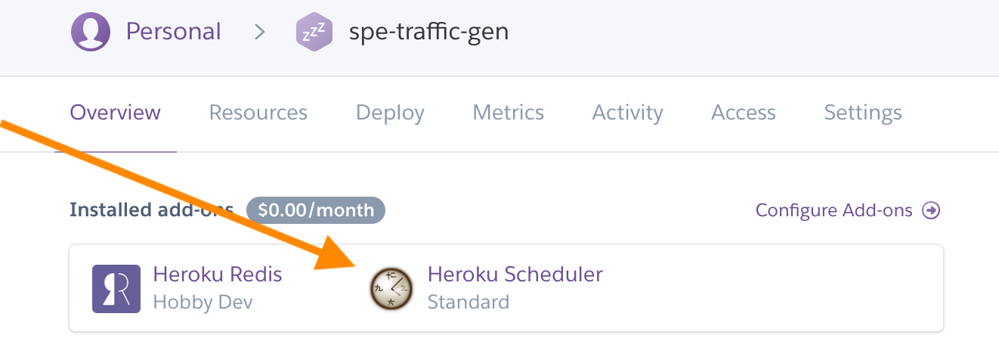
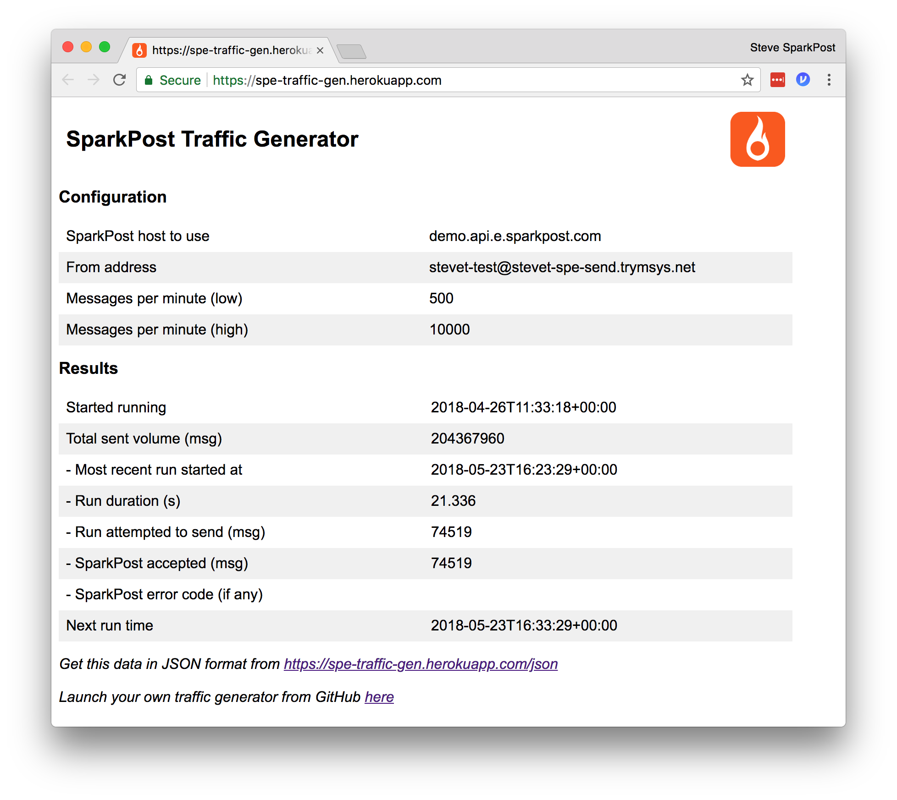

<a href="https://www.sparkpost.com"></a>

[Sign up](https://app.sparkpost.com/join?plan=free-0817?src=Social%20Media&sfdcid=70160000000pqBb&pc=GitHubSignUp&utm_source=github&utm_medium=social-media&utm_campaign=github&utm_content=sign-up) for a SparkPost account and visit our [Developer Hub](https://developers.sparkpost.com) for even more content.

# SparkPost Traffic Generator

[](https://travis-ci.org/tuck1s/sparkpost-traffic-gen)

A simple app, which can easily be deployed to Heroku, to generate random traffic through your SparkPost
account towards the "bouncy sink".  Note that all sent messages count towards your account usage.

## Deploying to Heroku

Pre-requisites: a Heroku account, verified via credit card (free tier is fine).  Click here:

<a href="https://heroku.com/deploy">
  
</a>
<br>

- Choose a name for your Heroku app (must start with a lowercase letter).

- Enter your values for the environment variables.  You'll need a valid SparkPost API key and sending domain.

- After a short time Heroku should report **`Build finished`**

- Configure the scheduler:
    - From your app overview, click next to clock icon:
    
    
    - Add New Job.  In command box, type `./sparkpost-traffic-gen.py`
    
    - Choose Schedule Every 10 Minutes.  Next due time is displayed.
 

- Open the app to view metrics on your generator.

### Environment variables (configured via Heroku's start dialog):

```txt
SPARKPOST_HOST (optional)
    The URL of the SparkPost API service you're using. Defaults to https://api.sparkpost.com.

SPARKPOST_API_KEY
    API key on your SparkPost account, with transmission rights.

MESSAGES_PER_MINUTE_LOW
    Lowest number of messages to be sent per minute, from 0 to 10000

MESSAGES_PER_MINUTE_HIGH
    Highest number of messages to be sent per minute, from 0 to 10000

FROM_EMAIL
    FROM address belonging to a valid sending domain on your account.  e.g. fred@example.com
```

## Traffic handling
The `bouncy-sink` recipient domain responds to traffic according to a statistical model:


## Monitoring

Click Open App (top right). Results appear once scheduler has run at least once.  Does _not_ display your API key as it's a public page.  You should see a screen below.

For detailed logs, go to App Settings / More / View Log file.

A JSON-format reporting endpoint is also available - see app main screen for a link (URL ending in `/json`).



## Changing settings, stopping

While running, you can change values in the Settings / Reveal Config Vars page.  Changes are displayed on Open App screen immediately and affect traffic on the next scheduled run. No need to restart dynos.

To stop traffic, go to your app overview, select the Scheduler (clock icon), select "Remove".

### Changing settings in the code

If you wish to generate traffic going to some place other than the `bouncy-sink`, the code can easily be changed. 

Note that sending traffic to real ISP domains with fake addresses is likely to harm your [reputation](https://www.sparkpost.com/blog/email-reputation-matters/) - use with care.

You can also easily customise
- the metadata included with each recipient (Cities, Genders)
- The target link that will be clicked by the sink
- Campaign names
- Subject lines
- Link names (that appear in the SparkPost Engagement report, for example)
- `To` address prefix and name
- Default send interval that your scheduler is running to (used to translate the per-minute env var settings into numbers)
- API call batch size (chosen for efficiency)

# See also
Internal documentation, and install instructions for other platforms in  [INSTALLING.md](INSTALLING.md)

How to contribute to this project: [CONTRIBUTING.md](CONTRIBUTING.md)